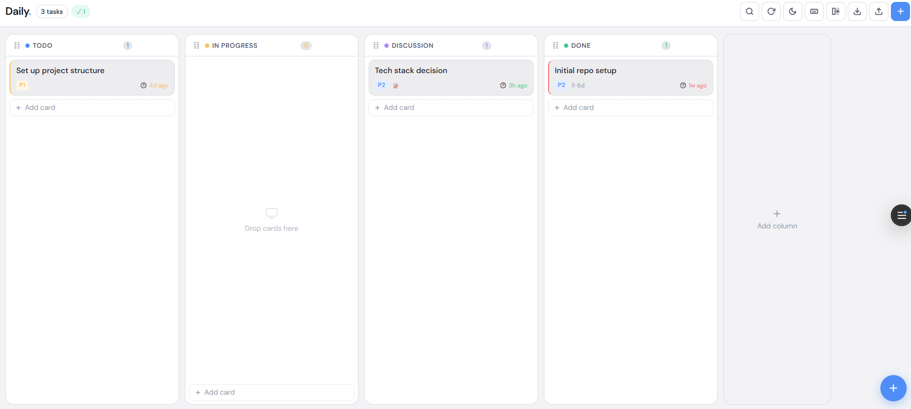

# Daily.

A clean and minimal space for your daily workflow.

Instead of writing plans, tasks, updates, and notes here & there — keep everything in one place.

---

## ✨ What is Daily.?

Daily. is a lightweight productivity & daily tracking app that can be used as:

- 📝 Personal daily diary
- ✅ Task / work tracker
- 📌 Planning board
- 🚧 Blocker tracker
- 📊 Progress manager

Whether you're working solo, studying, freelancing, or managing a team — Daily. helps you stay organized without clutter.

---

## 🚀 Features

- Drag & drop workflow
- Create custom statuses
- Daily work updates
- Markdown notes support
- Blocker highlighting
- Auto task aging
- Priority management
- Mobile responsive UI
- Local storage support
- Minimal & distraction-free design

---

## 💡 Why Daily.?

Most productivity tools become too heavy.

Daily. focuses on simplicity:
write what you're doing, what’s pending, what’s blocked, and what’s next — all in one place.

---

## 🛠 Built With

- React
- Vanilla CSS
- LocalStorage
- Vercel Deployment

---

## 🌐 Live Demo

[Open Daily.](https://daily-one-coral.vercel.app/)

---

## 📸 Preview

---

## ❤️ Feedback

Would love feedback, ideas, and feature suggestions.

If you like the project, consider giving it a ⭐